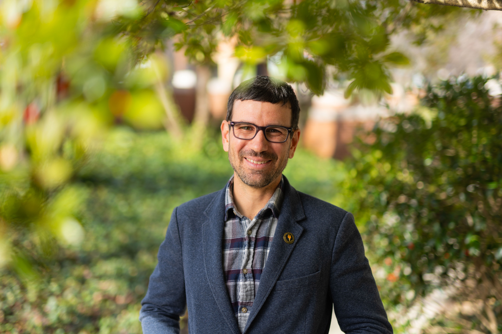

:::: {.grid}

::: {.g-col-12 .g-col-md-7}
# Helping teachers, learners, and educational systems learn from [data]{.accent}

I'm Josh Rosenberg, Haslam Family Professor and Associate Professor of STEM Education at the University of Tennessee, Knoxville. I study the use of data in education: how new data sources and methods can help us understand teaching, learning, and educational systems, and how students and teachers can learn to work with data themselves.

Much of this work happens in partnership with teachers and schools, especially in science classrooms.

[Research](research.qmd){.btn .btn-primary .me-2 .mb-2} [Teaching](teaching.qmd){.btn .btn-outline-primary .me-2 .mb-2} [CV](vita.html){.btn .btn-outline-primary .me-2 .mb-2} [Contact](contact.qmd){.btn .btn-outline-primary .mb-2}
:::

::: {.g-col-12 .g-col-md-5}
{fig-alt="Portrait of Joshua Rosenberg" fig-align="center"}
:::

::::

## Featured Projects & Resources

:::: {.grid}

::: {.g-col-12 .g-col-md-4 .feature-card}
#### [Project CREDIBLE](https://projectcredible.com/)

An NSF CAREER-funded research-practice partnership on helping students learn with data in science classrooms.

[Learn more](https://projectcredible.com/){.btn .btn-outline-primary .btn-sm}
:::

::: {.g-col-12 .g-col-md-4 .feature-card}
#### [Making Data Science Count](https://makingdatasciencecount.com/)

My research group. We study educational data science, data science education, and STEM learning.

[Visit the group](https://makingdatasciencecount.com/){.btn .btn-outline-primary .btn-sm}
:::

::: {.g-col-12 .g-col-md-4 .feature-card}
#### [Data Science in Education Using R](https://datascienceineducation.com/)

An open-access book for researchers and educators working with data in education, accessed more than 150,000 times.

[Read the book](https://datascienceineducation.com/){.btn .btn-outline-primary .btn-sm}
:::

::::

## Writing & Photography

I also write and take photos, mostly about family, hiking, and life in East Tennessee. With my wife, Katie, I wrote [*Hiking Knoxville: Family Friendly Adventures from the City to the Smokies*](https://familyhikesaroundknox.com/) (University of Tennessee Press, 2026), and I write an occasional newsletter, [Educated Guesses](https://joshuamrosenberg.substack.com/).

[Hiking Knoxville](https://familyhikesaroundknox.com/){.btn .btn-outline-primary .me-2 .mb-2} [Writing & Photography](writing-and-photography.qmd){.btn .btn-outline-primary .mb-2}

::: {.contact-band}
## Contact

If you're interested in working together — or are a student thinking about graduate study — please reach out. Email is best: [jrosenb8\@utk.edu](mailto:jrosenb8@utk.edu).

[Contact](contact.qmd){.btn .btn-primary}
:::
