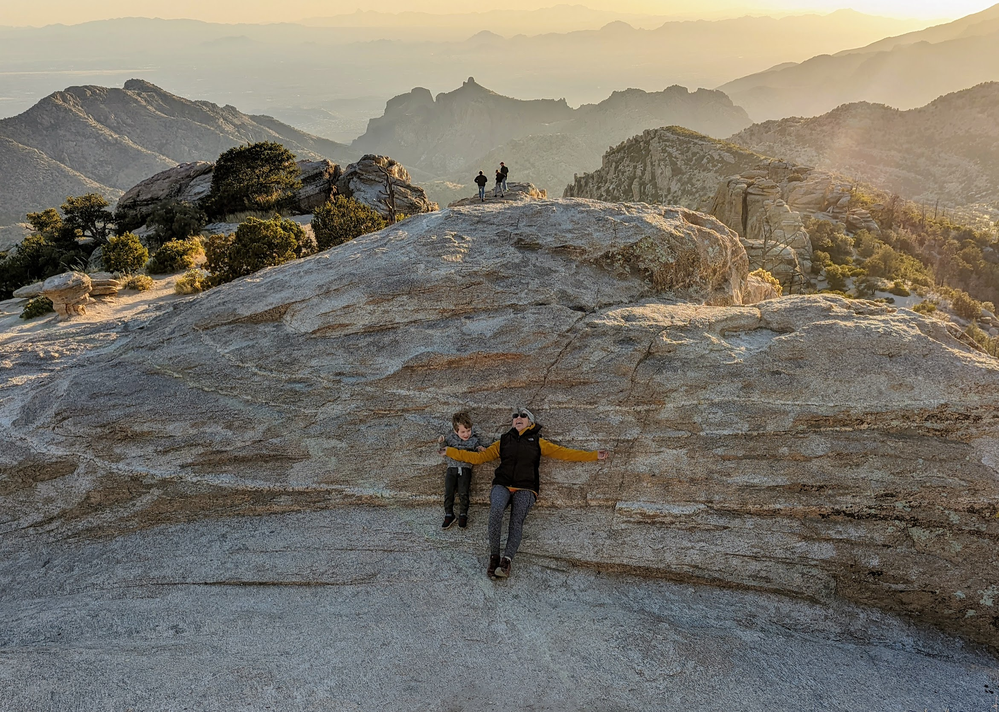
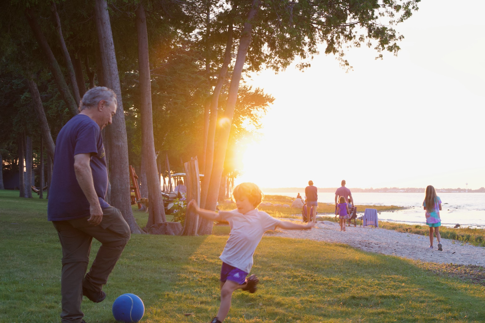

I write and take photos outside of work, too — mostly about family, hiking, and life in East Tennessee.

## Hiking Knoxville

With my wife, Katie, I wrote [*Hiking Knoxville: Family Friendly Adventures from the City to the Smokies*](https://familyhikesaroundknox.com/) (University of Tennessee Press, 2026), a guide to 30 family-friendly hikes in Knoxville, on the Cumberland Plateau, and in the Great Smoky Mountains.

[Learn About Hiking Knoxville](https://familyhikesaroundknox.com/){.btn .btn-primary}

## Writing

I write an occasional newsletter, [Educated Guesses](https://joshuamrosenberg.substack.com/), about education, data, family, and whatever else I'm thinking about. Older posts are at my [previous blog (archive)](https://jrosen48.github.io/utk-homepage/).

[Read on Substack](https://joshuamrosenberg.substack.com/){.btn .btn-outline-primary}

## Photography

I am an *amateur* photographer, with an affinity for portrait and landscape photos. Here are some favorite photos. They have the [CC-BY-NC](https://creativecommons.org/licenses/by-nc/4.0/) license.

.JPG)

.jpeg){width="1400"}
